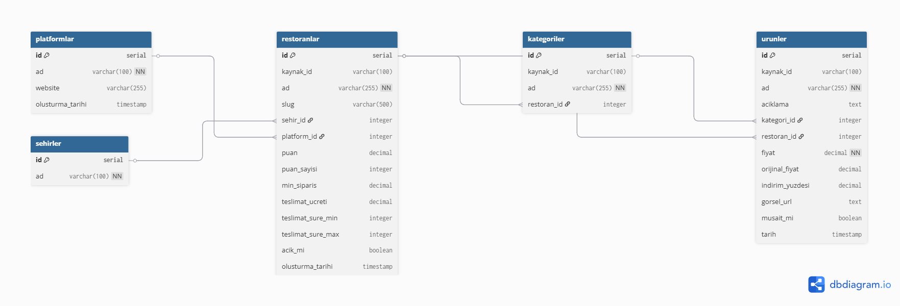
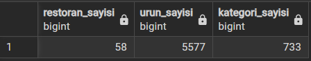
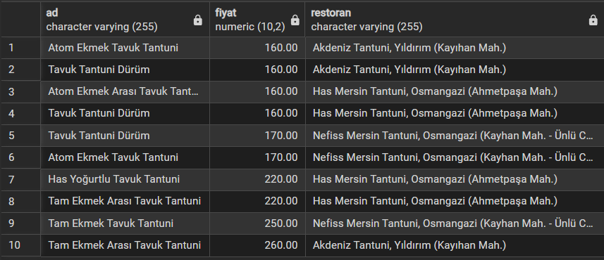
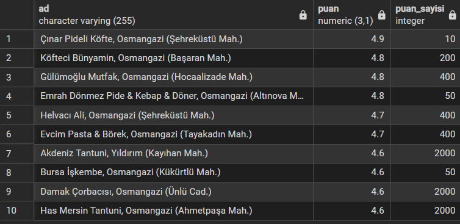

# Ne Yesem — Veritabanı Modülü

Farklı yemek platformlarından (Getir Yemek, Trendyol Go, Yemeksepeti) çekilen verileri PostgreSQL veritabanına kaydeden ve karşılaştırma yapan modül.

## Veritabanı Şeması



## Kurulum

### 1. PostgreSQL
- [PostgreSQL](https://www.postgresql.org/download/) kurun
- `ne_yesem` adında bir veritabanı oluşturun
- `schema.sql` dosyasını çalıştırarak tabloları oluşturun:

```bash
psql -U postgres -d ne_yesem -f schema.sql
```

### 2. Python Bağımlılıkları

```bash
pip install -r requirements.txt
```

### 3. Ortam Değişkenleri

`.env.example` dosyasını `.env` olarak kopyalayın ve kendi şifrenizi yazın:

```bash
cp .env.example .env
```

## Kullanım

```bash
# JSON dosyalarını veritabanına aktar
python json_to_db.py --folder output/bursa/getir_yemek

# Şehir adını manuel belirt
python json_to_db.py --folder output/istanbul/getir_yemek --sehir istanbul

# Veritabanı istatistiklerini gör
python json_to_db.py --istatistik
```

## Veritabanı Yapısı

| Tablo | Açıklama |
|-------|----------|
| `platformlar` | Veri kaynakları (Getir Yemek, Trendyol Go...) |
| `sehirler` | Şehirler (Bursa, İstanbul...) |
| `restoranlar` | Restoran bilgileri, puan, teslimat ücreti |
| `kategoriler` | Menü kategorileri (Pizza, İçecek...) |
| `urunler` | Ürünler, fiyatlar, indirim bilgisi |

## Örnek Sorgu Çıktıları

### Veritabanı İstatistikleri

```sql
SELECT 
    (SELECT COUNT(*) FROM restoranlar) AS restoran_sayisi,
    (SELECT COUNT(*) FROM urunler) AS urun_sayisi,
    (SELECT COUNT(*) FROM kategoriler) AS kategori_sayisi;
```



### Tantuni Fiyat Karşılaştırması

```sql
SELECT u.ad, u.fiyat, r.ad AS restoran
FROM urunler u
JOIN restoranlar r ON u.restoran_id = r.id
WHERE u.ad ILIKE '%tantuni%'
ORDER BY u.fiyat
LIMIT 10;
```



### En Yüksek Puanlı Restoranlar

```sql
SELECT ad, puan, puan_sayisi
FROM restoranlar
ORDER BY puan DESC
LIMIT 10;
```




